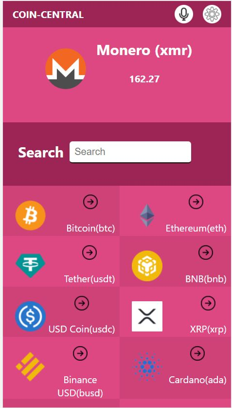
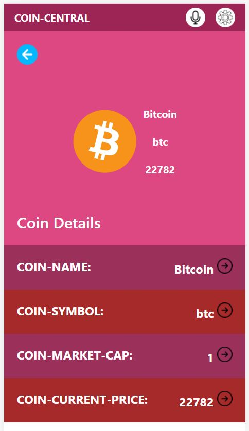
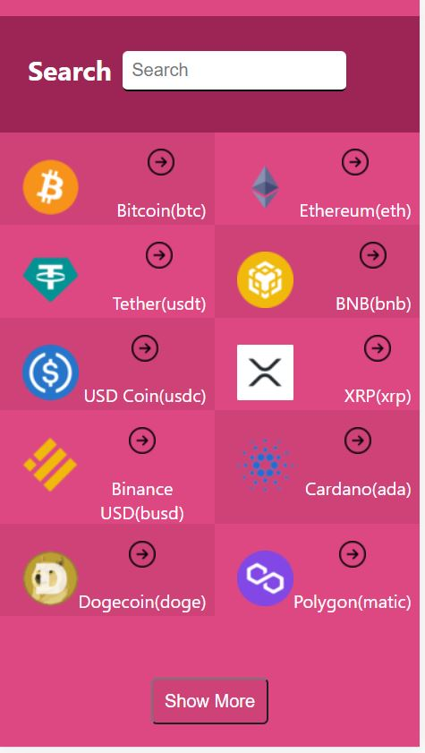
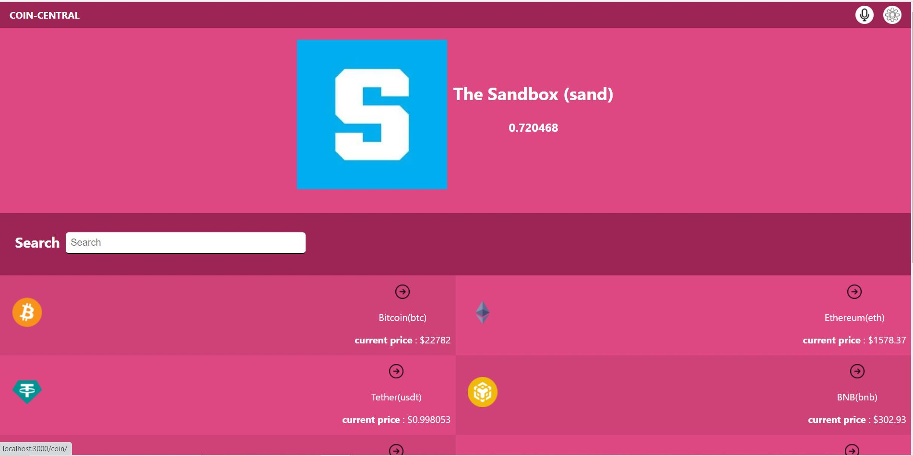
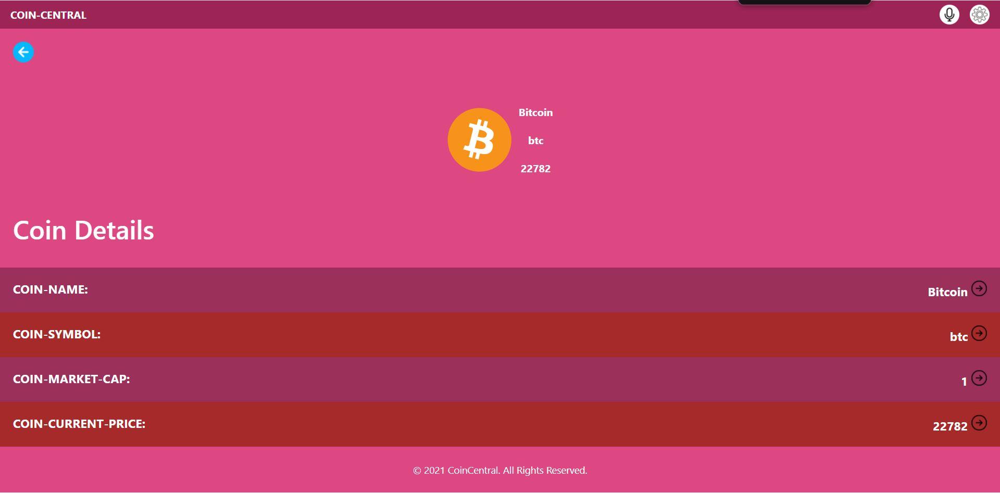

<!-- TABLE OF CONTENTS -->

# 📗 Table of Contents

- [📖 About the Project](#about-project)
  - [🛠 Built With](#built-with)
    - [Tech Stack](#tech-stack)
    - [Key Features](#key-features)
  - [🚀 Live Demo](#live-demo)
- [💻 Getting Started](#getting-started)
  - [Setup](#setup)
  - [Prerequisites](#prerequisites)
  - [Install](#install)
  - [Usage](#usage)
  - [Run tests](#run-tests)
  - [Deployment](#triangular_flag_on_post-deployment)
- [👥 Authors](#authors)
- [🔭 Future Features](#future-features)
- [🤝 Contributing](#contributing)
- [⭐️ Show your support](#support)
- [🙏 Acknowledgements](#acknowledgements)
- [❓ FAQ (OPTIONAL)](#faq)
- [📝 License](#license)

<!-- PROJECT DESCRIPTION -->

# 📖 BOOK STORE 

> This is a crypto-currency website that uses coingecko api to fetch coin details

## 🛠 Built With 

REACT REACT-REDUX JEST

### Tech Stack 

> REACT-REDUX

<!-- Features -->

### Key Features 

- **[SEARCH FOR CRYPTO]**

  - [Description] ABILITY TO SEARCH FOR CRYPTO

(<a href="#readme-top">back to top</a>)

<!-- LIVE DEMO -->

## 🚀 Live Demo 

> Here is a DEMO link to site and a video recording of me explaining the site

- [Live Demo Link](https://coincentral.onrender.com)

-[Live Demo Video](https://www.loom.com/share/46dee996a92647e8a9cb15bf3599fa5f)

(<a href="#readme-top">back to top</a>)

<!-- GETTING STARTED -->

## 💻 Getting Started 

> To start using this project you need to clone the repository and follow the other requirements below

### Prerequisites

In order to run this project you need:
VS CODE
BROWSER
INTERNET CONNECTION
NODE.JS INSTALLED

### Setup

Clone this repository to your desired folder:

- cd my-folder
- git clone git@github.com:Dmambo/coincentral.git
- cd coincentral

### Install

Install this project with:

  cd coincentral
  npm install

install other dependencies

npm i --save-dev

### Usage

To run the project, execute the following command:

  npm start

(<a href="#readme-top">back to top</a>)

<!-- AUTHORS -->

## 👥 Authors 

👤 **IBRAHIM**

- GitHub: [@Dmambo](https://github.com/Dmambo)
- Twitter: [@kingibro345](https://twitter.com/kingibro345)
- LinkedIn: [LinkedIn](https://linkedin.com/in/Diaby mohammed ibrahim)

(<a href="#readme-top">back to top</a>)

<!-- CONTRIBUTING -->

## 🤝 Contributing 

Contributions, issues, and feature requests are welcome!

Feel free to check the [issues page](../../issues/).

(<a href="#readme-top">back to top</a>)

<!-- SUPPORT -->

## ⭐️ Show your support 

If you like this project please star the repository

(<a href="#readme-top">back to top</a>)

<!-- ACKNOWLEDGEMENTS -->

## 🙏 Acknowledgments 

I would like to thank [sakwadesignstudio](https://www.behance.net/sakwadesignstudio) the author of the original [design](https://www.behance.net/gallery/31579789/Ballhead-App-(Free-PSDs))

(<a href="#readme-top">back to top</a>)

<!-- FAQ (optional) -->

## ❓ FAQ (OPTIONAL) 

- **[What are the technology used]**

  - [REACT, REDUX and JEST for testing]

- **[What features are there]**

  - [You can search for coin and also view the details of any coin]

(<a href="#readme-top">back to top</a>)

<!-- LICENSE -->

## 📝 License 

This project is [MIT](./LICENSE) licensed.

(<a href="#readme-top">back to top</a>)

